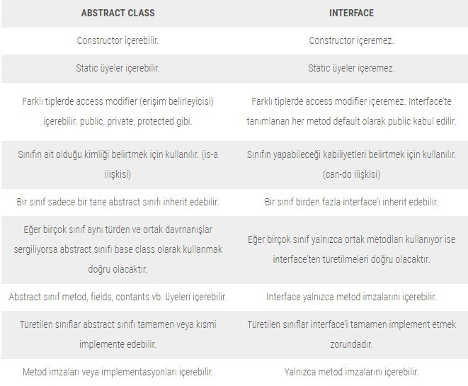

# Abstract Class Yapısı

> Abstract sınıflar sınıf hiyerarşisinde genellikle base class (temel sınıf) tanımlamak için kullanılan ve soyutlama yeteneği kazandıran sınıflardır. Bir sınıfı abstract yapmak için **abstract** keywordünü kullanırız. Abstract sınıflar en az bir tane abstract metod bulundurması bir best practice’tir.

## İs-a İlişki Örnekler

Kiraz , kiraz olabilmesinin yanında aynı zamanda da bir meyvedir.

Çarpışan araba , araba özelliklerini taşır gibi.

## Can-do İlişki Örnekler

Arabaya ait olan hızlanma özelliği, Kiraz meyvesinin büyümesi gibi.